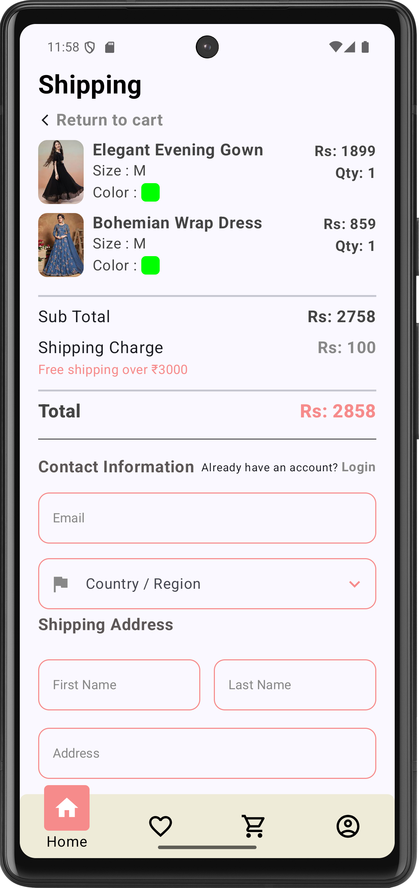
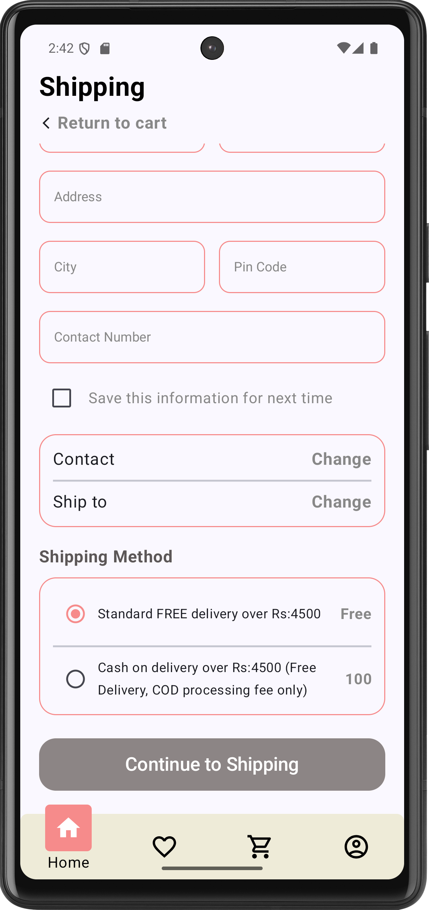
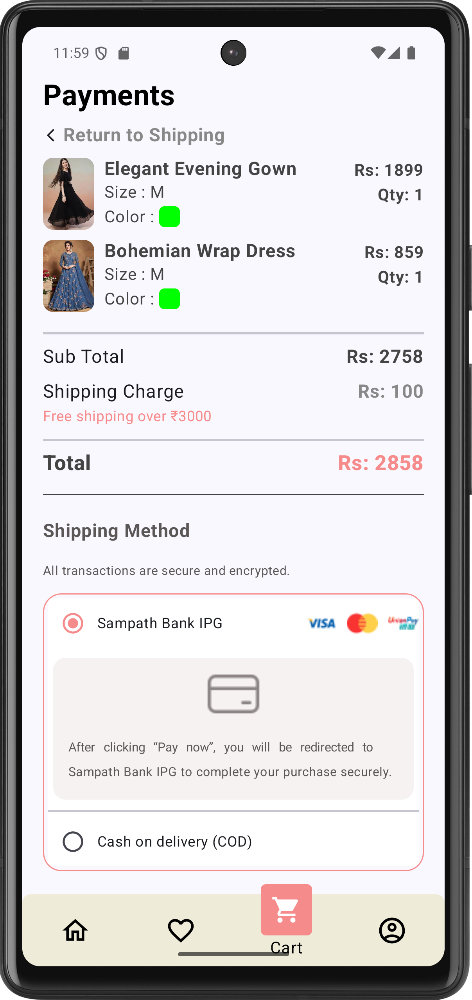
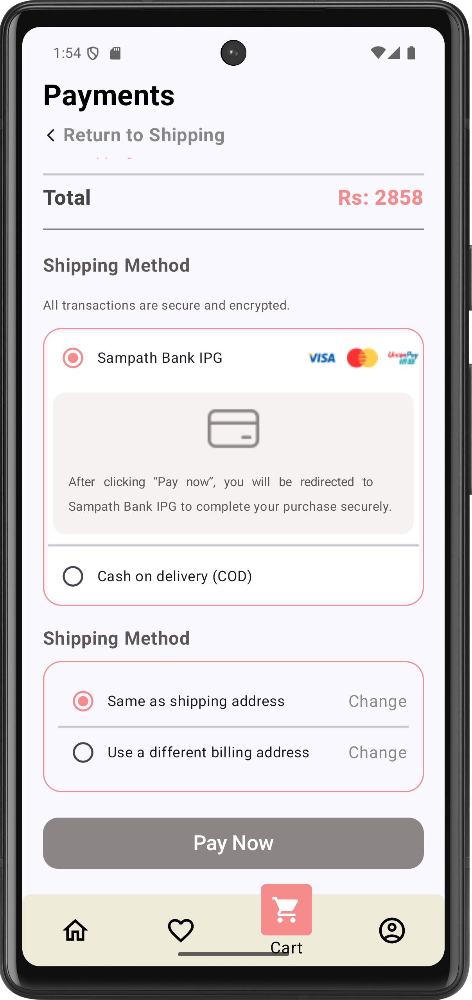
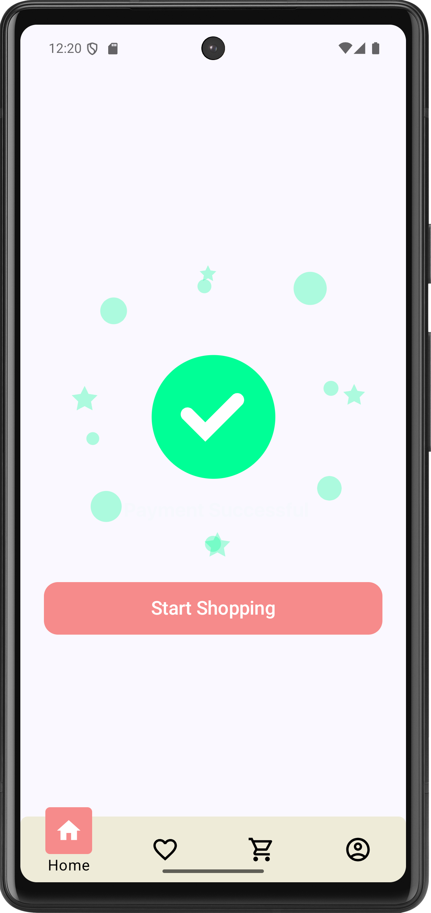
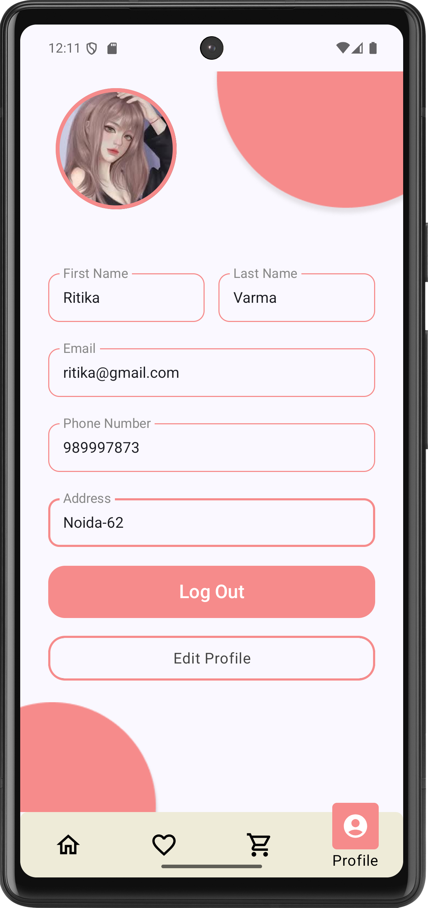

# Shopping App

A fully functional **shopping app** built with **Jetpack Compose**, **Kotlin** and **Firebase**. The app provides a smooth shopping experience with features like product browsing, cart management, and secure checkout with razorpay payment gateway.

## Features
✔️ Splash Screen
✔️ Firebase Authentication (Login & Signup)
✔️ Home Screen With Categories, Banner & Flash Products
✔️ Product Details with Add to Cart & Buy Now
✔️ Shopping Cart & Checkout
✔️ Payment Getway & Order Success
✔️ Profile Management
✔️ Wishlist & Notifications

---

## 1️⃣ Splash Screen, Login & Signup
  

- Displays the app logo and initializes data.
- **Firebase Authentication** used for user login & registration.
- Secure sign-in with email & password.
- Login with facebook & google

---

## 2️⃣ Home Screen, Categories & Flash Product
   

- Browse products by categories.
- Search bar for quick navigation.
- Notifications & profile access.
- When Click on Category Open New Screen with filterd products by Category

---
## 3️⃣ SeeMore Product & Categories & Search Filter
  

- On Click See All categories .
- On Click See All Flash Product.
- Filter with Searching Product

---


## 4️⃣ Product Details
  

- View product information, pricing, sizes, colors and images.
- **Buy Now** or **Add to Cart** options available.
- **Add Wishlist** or **Remove Wishlist** options available.

---

## 5️⃣ Cart & Checkout
  

- View added products in cart.
- Proceed to checkout with shipping details.

---

## 6️⃣ Payment & Order Success
   

- Secure payment processing.
- Order confirmation screen after successful purchase.

---

## 7️⃣ Profile & Logout
 

- Users can see their profile details
- Manage & Edit account details.
- All data is fetched from Firebase Realtime Database.
- Users can:
Modify name, email, phone, and address.
Change the profile picture.
Save changes by clicking "Update Profile", which updates the data in Firebase.
- Clicking "Log Out Button" opens a confirmation popup.
- When Click "Log Out" on popup: Signs out the user from Firebase Authentication.
Redirects them to the Login Screen.


  

---

## 📌 How to Run the Project
1. Clone the repository:
   ```sh
   git clone https://github.com/Sandeepsahu1411/ShoppingApp.git
   ```
2. Open the project in **Android Studio**.
3. Sync Gradle & Run the project on an emulator or physical device.

---

## 📞 Contact
For queries, feel free to reach out:
📧 Email: [your-email@example.com](mailto:your-email@example.com)

