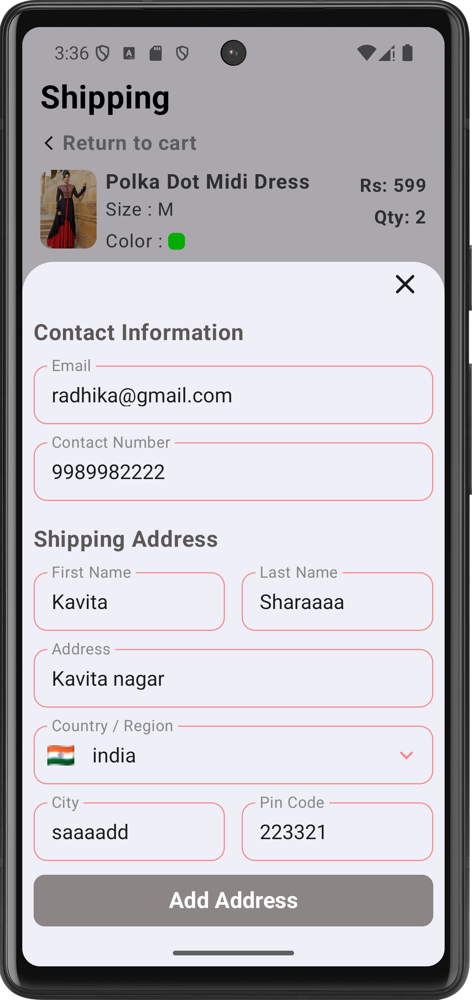

# 🛒 Shopping App

A fully functional **Shopping App** built using **Jetpack Compose**, **Kotlin**, and **Firebase**. It provides a seamless shopping experience with features like product browsing, cart management, order tracking, profile updates, and secure checkout with **Razorpay** and **Cash on Delivery**.

---
## ✨ Features

- 🚀 Splash Screen  
- 🔐 Firebase Authentication (Email/Password, Google, Facebook)  
- 🏠 Home Screen with Categories, Banners & Flash Products  
- 📦 Product Details with Cart & Buy Options  
- 🛒 Shopping Cart & Checkout  
- 💳 Razorpay Payment Integration + COD Option  
- ✅ Order Confirmation & Success Flow  
- 📬 Shipping Address Management  
- 🧾 Order List & Tracking  
- ❤️ Wishlist & 🔔 Notifications  
- 👤 Profile Management & Logout  
## 📲 Screens & Functionalities

### 1️⃣ Splash Screen, Login & Signup
  

- Splash screen initializes user state and navigates accordingly.
- **Firebase Authentication** for Email/Password, Google, and Facebook login.
- Validations and error messages handled smoothly.

---

### 2️⃣ Home Screen, Banners, Categories, Flash Products
   

- Explore products by categories.
- Flash sale section with limited-time offers.
- Top banners fetched from Firebase Storage.
- Tap on any category → Opens new screen with filtered product list.

---

### 3️⃣ See More Products, Category Filter, Search Filter
  

- See All Categories and Flash Products in dedicated screens.
- Filter products using category or keyword search.
- Search bar supports dynamic filtering and suggestions.

---

### 4️⃣ Product Details Screen 
  

- Displays product info: Name, Price, Size, Color, Stock.
- **Buy Now** launches bottom sheet to choose quantity and proceed.
- **Add to Cart** updates the cart state in Firebase.
- Wishlist feature with toggle animation (add/remove).

---

### 5️⃣ Cart & Shipping Address Screen
  

- View cart items with quantity, price, and total calculation.
- Increase or decrease quantity.
- Proceed to checkout with saved shipping address or add a new one.
- Real-time updates with Firebase.

---

### 6️⃣ Payment Gateway & Order Success
    

- Choose between **Razorpay** for online payment or **Cash on Delivery (COD)**.
- Payment success triggers order creation in Firebase.
- Displays success screen with Animation.

---

### 7️⃣ Order Management & Tracker
  

- View all past orders in the Orders section.
- Tap an order → Order details with item list, price, address, and status.
- Real-time order tracking UI: Ordered → Packed → Shipped → Delivered.

---

### 8️⃣ Wishlist & Notifications
 

- Add/remove products to Wishlist.
- Notification screen to show latest offers, order status, and messages.

---

### 9️⃣ Profile Management & Logout
 

- Displays user info: name, email, phone, address, profile picture.
- Edit profile data and update to Firebase in real-time.
- Log out triggers a confirmation popup → signs out user from Firebase and navigates to login.
- On click My Order Button screen navigate to orders screen info

---

## 🔧 Tech Stack

- **Language:** Kotlin  
- **UI:** Jetpack Compose  
- **Auth:** Firebase Authentication (Email, Google, Facebook)  
- **Database:** Firebase Realtime Database  
- **Storage:** Firebase Storage  
- **Image Loading:** Coil  
- **Architecture:** MVVM + State Hoisting  
- **Payment:** Razorpay SDK  
- **Navigation:** Jetpack Navigation Compose
- **Mode:** Dark Mode Supported

---

## 📌 How to Run the Project
1. Clone the repository:
   ```sh
   git clone https://github.com/Sandeepsahu1411/ShoppingApp.git
   ```
2. Open the project in **Android Studio**.
3. Sync Gradle & Run the project on an emulator or physical device.

---

## 📞 Contact
For queries, feel free to reach out:
📧 Email: [sahusandeep26475@gmail.com](mailto:sahusandeep26475@gmail.com)


